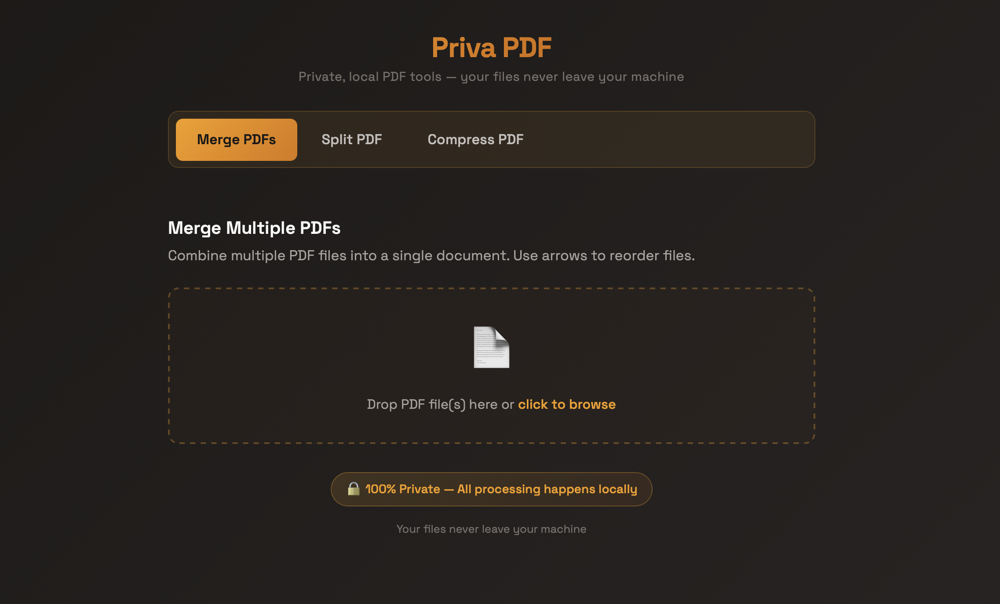

# 🔒 Priva PDF

I built this tool for personal use because I refuse to upload my passport or bank statements to random websites just to merge or shrink a file. Most "free" online PDF tools are a privacy nightmare; priva_pdf is a simple, local-first alternative that ensures your sensitive data never leaves your machine.

No cloud uploads. No tracking. No bloat.



## Features

- **Merge PDFs** - Combine multiple PDF files into a single document
- **Split PDF** - Extract specific pages or split a PDF into multiple files
- **Compress PDF** - Reduce file size with adjustable quality levels
- **🌐 Web Interface** - User-friendly dashboard for all operations
- **CLI Support** - Command-line interface for automation and scripting
- **100% Private** - All processing happens locally on your machine

## Requirements

- Python 3.9 or higher
- macOS, Windows, or Linux

## Installation

### Step 1: Clone or Download the Repository

```bash
git clone https://github.com/yourusername/priva_pdf.git
cd priva_pdf
```

### Step 2: Create a Virtual Environment

#### On macOS/Linux:

```bash
# Create virtual environment
python3 -m venv venv

# Activate virtual environment
source venv/bin/activate
```

#### On Windows:

```bash
# Create virtual environment
python -m venv venv

# Activate virtual environment (Command Prompt)
venv\Scripts\activate.bat

# OR (PowerShell)
venv\Scripts\Activate.ps1
```


### Step 3: Install Dependencies

```bash
pip install -r requirements.txt
```

## Usage

Priva PDF offers two ways to use the tool: a web interface and a command-line interface.

### Web Interface (Recommended for Most Users)

Start the web application:

```bash
python app.py
```

The application will start on `http://localhost:8050`. Open this URL in your web browser to access the dashboard where you can:
- Upload and merge multiple PDFs
- Split PDFs by page ranges
- Compress PDFs with different quality levels
- Download processed files instantly

### Command-Line Interface (CLI)

Perfect for automation, scripting, or quick operations.

#### Merge PDFs

```bash
# Basic merge
python main.py merge file1.pdf file2.pdf file3.pdf -o combined.pdf

# Merge all PDFs in current directory
python main.py merge *.pdf -o all_combined.pdf
```

#### Compress a PDF

```bash
# Default medium compression
python main.py compress large_scan.pdf -o smaller.pdf

# High compression for iPhone scans
python main.py compress iphone_scan.pdf -l high -o compressed.pdf

# Extreme compression (lower quality)
python main.py compress document.pdf -l extreme -o tiny.pdf
```

#### Merge and Compress in One Step

```bash
python main.py merge-compress scan1.pdf scan2.pdf -o final.pdf -l high
```

## Compression Levels

| Level    | Quality | File Size Reduction | Best For                        |
|----------|---------|---------------------|----------------------------------|
| low      | 85%     | ~10-20%            | Documents needing minimal reduction |
| medium   | 65%     | ~30-50%            | General purpose (default)        |
| high     | 45%     | ~50-70%            | iPhone scans, image-heavy PDFs   |
| extreme  | 25%     | ~70-85%            | Maximum compression, lower quality |

## Programmatic Usage

You can also use Priva PDF as a Python library in your own scripts:

```python
from pathlib import Path
from src.pdf_tool import PdfTool
from src.pdf_compressor import CompressionLevel

tool = PdfTool()

# Merge PDFs
tool.merge(
    [Path("doc1.pdf"), Path("doc2.pdf")],
    Path("merged.pdf")
)

# Compress a PDF
tool.compress(
    Path("large.pdf"),
    Path("small.pdf"),
    CompressionLevel.HIGH
)

# Merge and compress in one step
tool.merge_and_compress(
    [Path("scan1.pdf"), Path("scan2.pdf")],
    Path("output.pdf"),
    CompressionLevel.HIGH
)
```

## 🗂️ Project Structure

```
priva_pdf/
├── app.py                  # Web application entry point
├── main.py                 # CLI entry point
├── requirements.txt        # Python dependencies
├── app/                    # Web interface components
│   ├── callbacks.py        # Dash callbacks for interactivity
│   ├── components.py       # Reusable UI components
│   ├── layout.py           # Page layout definitions
│   └── styles.py           # Custom CSS styling
├── src/                    # Core PDF processing logic
│   ├── cli.py              # Command-line interface
│   ├── pdf_compressor.py   # PDF compression functionality
│   ├── pdf_merger.py       # PDF merging functionality
│   ├── pdf_splitter.py     # PDF splitting functionality
│   └── pdf_tool.py         # Main PDF tool wrapper
└── imgs/                   # ReadMe images
```

## FAQ

### Why should I use Priva PDF instead of online tools?

Online PDF tools often upload your files to their servers, which can be a privacy risk for sensitive documents like passports, bank statements, or medical records. Priva PDF processes everything locally on your machine.

## 🛠️ Troubleshooting

### Issue: "Command not found: python3"
- **Windows**: Use `python` instead of `python3`
- **macOS/Linux**: Install Python 3 from [python.org](https://www.python.org/downloads/)

### Issue: Web interface won't start
- Make sure port 8050 is not in use by another application
- Check that all dependencies are installed: `pip install -r requirements.txt`
- Verify your virtual environment is activated

### Issue: "ModuleNotFoundError"
- Ensure you've activated the virtual environment
- Reinstall dependencies: `pip install -r requirements.txt`

## License

This project is open source and available for personal and commercial use.

## Contributing

Contributions, issues, and feature requests are welcome! Feel free to check the issues page.